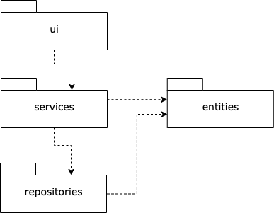
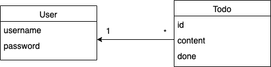
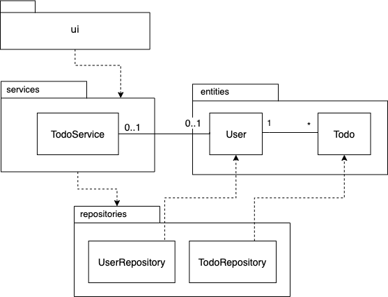
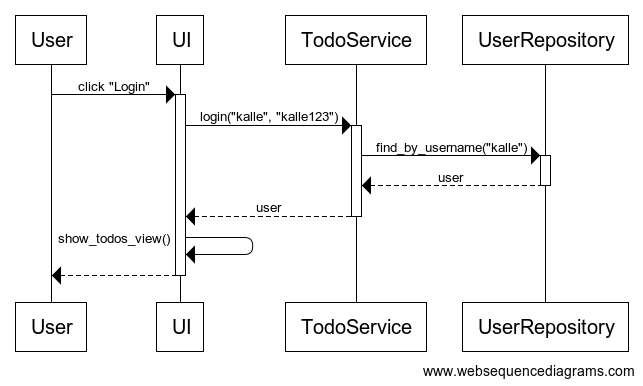
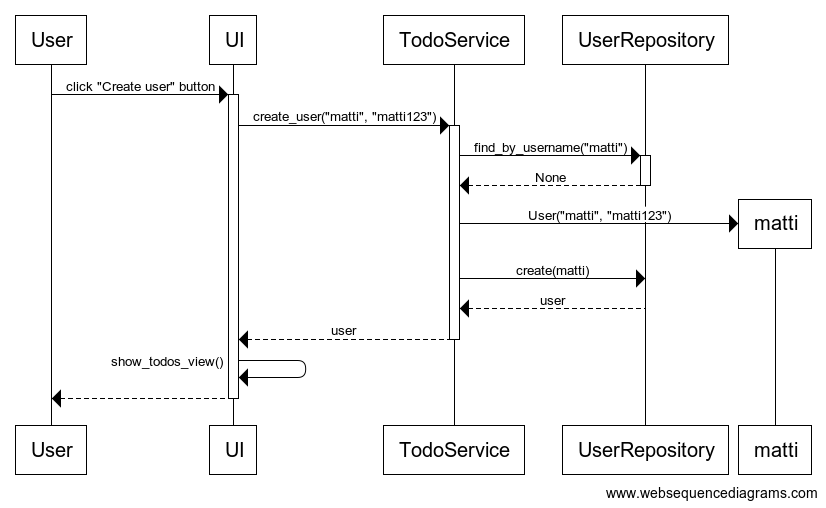
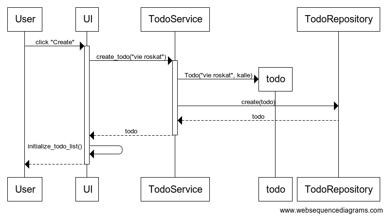

# Arkkitehtuurikuvaus

## Rakenne

Ohjelman rakenne noudattelee kolmitasoista kerrosarkkitehtuuria, ja koodin pakkausrakenne on seuraava:



Pakkaus _ui_ sisältää käyttöliittymästä, _services_ sovelluslogiikasta ja _repositories_ tietojen pysyväistallennuksesta vastaavan koodin. Pakkaus _entities_ sisältää luokkia, jotka kuvastavat sovelluksen käyttämiä tietokohteita.

## Käyttöliittymä

Käyttöliittymä sisältää kolme erillistä näkymää:

- Kirjautuminen
- Uuden käyttäjän luominen
- Todo-lista

Jokainen näistä on toteutettu omana luokkanaan. Näkymistä yksi on aina kerrallaan näkyvänä. Näkymien näyttämisestä vastaa [UI](../src/ui/ui.py)-luokka. Käyttöliittymä on pyritty eristämään täysin sovelluslogiikasta. Se ainoastaan kutsuu [TodoService](../src/services/todo_service.py)-luokan metodeja.

Kun sovelluksen todo-listan tilanne muuttuu, eli uusi käyttäjä kirjautuu, todoja merkitään tehdyksi tai niitä luodaan, kutsutaan sovelluksen metodia [initialize_todo_list](https://github.com/ohjelmistotekniikka-hy/python-todo-app/blob/master/src/ui/todos_view.py#L70) joka renderöi todolistanäkymän uudelleen sovelluslogiikalta saamansa näytettävien todojen listan perusteella.

## Sovelluslogiikka

Sovelluksen loogisen tietomallin muodostavat luokat [User](https://github.com/ohjelmistotekniikka-hy/python-todo-app/blob/master/src/entities/user.py) ja [Todo](https://github.com/ohjelmistotekniikka-hy/python-todo-app/blob/master/src/entities/todo.py), jotka kuvaavat käyttäjiä ja käyttäjien tehtäviä:



Toiminnallisista kokonaisuuksista vastaa luokkan [TodoService](https://github.com/ohjelmistotekniikka-hy/python-todo-app/blob/master/src/services/todo_service.py) ainoa olio. Luokka tarjoaa kaikille käyttäliittymän toiminnoille oman metodin. Näitä ovat esimerkiksi:

- `login(username, password)`
- `get_undone_todos()`
- `create_todo(content)`
- `set_todo_done(todo_id)`

_TodoService_ pääsee käsiksi käyttäjiin ja todoihin tietojen tallennuksesta vastaavan pakkauksessa _repositories_ sijaitsevien luokkien [TodoRepository](https://github.com/ohjelmistotekniikka-hy/python-todo-app/blob/master/src/repositories/todo_repository.py) ja [UserRepository](https://github.com/ohjelmistotekniikka-hy/python-todo-app/blob/master/src/repositories/user_repository.py) kautta. Luokkien toteutuksen [injektoidaan](https://en.wikipedia.org/wiki/Dependency_injection) sovelluslogiikalle konstruktorikutsun yhteydessä.

`TodoService`-luokan ja ohjelman muiden osien suhdetta kuvaava luokka/pakkauskaavio:



## Tietojen pysyväistallennus

Pakkauksen _repositories_ luokat `TodoRepository` ja `UserRepository` huolehtivat tietojen tallettamisesta. `TodoRepository`-luokka tallentee tietoa CSV-tiedostoon, kun taas `UserRepository`-luokka SQLite-tietokantaan.

Luokat noudattavat [Repository](https://en.wikipedia.org/wiki/Data_access_object) -suunnittelumallia ja ne on tarvittaessa mahdollista korvata uusilla toteutuksilla, jos sovelluksen datan talletustapaa päätetään vaihtaa. Sovelluslogiikan testauksessa hyödynnetäänkin tätä siten, että testeissä käytetään tiedostoon ja tietokantaan tallentavien olioiden sijaan keskusmuistiin tallentavia toteutuksia.

### Tiedostot

Sovellus tallettaa käyttäjien ja todojen tiedot erillisiin tiedostoihin.

Sovelluksen juureen sijoitettu [konfiguraatiotiedosto](./kayttoohje.md#konfiguraatiotiedosto) [.env](https://github.com/ohjelmistotekniikka-hy/python-todo-app/blob/master/.env) määrittelee tiedostojen nimet.

Sovellus tallettaa tehtävät CSV-tiedostoon seuraavassa formaatissa:

```
65eef813-330a-4714-887b-2bda4d744487;opiskele pythonia;1;kalle
5749b61f-f312-45ef-94a1-71a758feee2b;kirjoita dokumentaatio;0;matti
```

Eli tehtävän id, sisältö, tehtystatus (0 = ei tehty, 1 = on tehty) ja käyttäjän käyttäjätunnus. Kenttien arvot erotellaan puolipisteellä (;).

Käyttäjät tallennetaan SQLite-tietokannan tauluun `users`, joka alustetaan [initialize_database.py](https://github.com/ohjelmistotekniikka-hy/python-todo-app/blob/master/src/initialize_database.py)-tiedostossa.

## Päätoiminnallisuudet

Kuvataan seuraavaksi sovelluksen toimintalogiikka muutaman päätoiminnallisuuden osalta sekvenssikaaviona.

### Käyttäjän kirjaantuminen

Kun kirjautumisnäkymän syötekenttiin kirjoitetetataan käyttäjätunnus ja salasana, jonka jälkeen klikataan painiketta _Login_, etenee sovelluksen kontrolli seuraavasti:



Painikkeen painamiseen reagoiva [tapahtumankäsittelijä](https://github.com/ohjelmistotekniikka-hy/python-todo-app/blob/master/src/ui/login_view.py#L18) kutsuu sovelluslogiikan `TodoService` metodia [login](https://github.com/ohjelmistotekniikka-hy/python-todo-app/blob/master/src/services/todo_service.py#L87) antaen parametriksi käyttäjätunnuksen ja salasanan. Sovelluslogiikka selvittää `UserRepository`:n avulla onko käyttäjätunnus olemassa. Jos on, tarkastetaan täsmääkö salasanat. Jos salasanat täsmäävät, kirjautuminen onnistuu. Tämän seurauksena käyttöliittymä vaihtaa näkymäksi `TodosView`:n, eli sovelluksen varsinaisen päänäkymän ja renderöi näkymään kirjautuneen käyttäjän todot eli tekemättömät tehtävät.

### Uuden käyttäjän luominen

Kun uuden käyttäjän luomisnäkymässä on syötetty käyttäjätunnus, joka ei ole jo käytössä sekä salasana, jonka jälkeen klikataan painiketta "Create" etenee sovelluksen kontrolli seuraavasti:



[Tapahtumakäsittelijä](https://github.com/ohjelmistotekniikka-hy/python-todo-app/blob/master/src/ui/create_user_view.py#L18) kutsuu sovelluslogiikan metodia [create_user](https://github.com/ohjelmistotekniikka-hy/python-todo-app/blob/master/src/services/todo_service.py#L130) antaen parametriksi luotavan käyttäjän tiedot. Sovelluslogiikka selvittää `UserRepository`:n avulla onko käyttäjätunnus olemassa. Jos ei, eli uuden käyttäjän luominen on mahdollista, luo sovelluslogiikka `User`-olion ja tallettaa sen kutsumalla `UserRepository`:n metodia `create`. Tästä seurauksena on se, että käyttöliittymä vaihtaa näkymäksi `TodosView`:n. Luotu käyttäjä kirjataan automaattisesti sisään.

### Todon luominen

Uuden todon luovan "Create"-painikkeen klikkaamisen jälkeen sovelluksen kontrolli eteneeseuraavasti:



[Tapahtumakäsittelijä](https://github.com/ohjelmistotekniikka-hy/python-todo-app/blob/master/src/ui/todos_view.py#L106) kutsuu sovelluslogiikan metodia [create_todo](https://github.com/ohjelmistotekniikka-hy/python-todo-app/blob/master/src/services/todo_service.py#L49) antaen parametriksi luotavan työn tiedot. Sovelluslogiikka luo uuden `Todo`-olion ja tallettaa sen kutsumalla `TodoRepository`:n metodia `create`. Tästä seurauksena on se, että käyttöliittymä päivittää näytettävät todot kutsumalla omaa metodiaan `initialize_todo_list`.

### Muut toiminnallisuudet

Sama periaate toistoo sovelluksen kaikissa toiminnallisuuksissa, käyttöliittymän tapahtumakäsittelijä kutsuu sopivaa sovelluslogiikan metodia, sovelluslogiikka päivittää todojen tai kirjautuneen käyttäjän tilaa. Kontrollin palatessa käyttäliittymään, päivitetään tarvittaessa todojen lista sekä aktiivinen näkyvä.

## Ohjelman rakenteeseen jääneet heikkoudet

### Käyttöliittymä

Graafisen käyttöliittymän koodissa on jonkin verran toisteisuuttaa, josta voisi toteuttaa omia komponenttejaan. Esimerkiksi pylint ilmoittaa toisteisesta koodista luokissa [CreateUserview](https://github.com/ohjelmistotekniikka-hy/python-todo-app/blob/master/src/ui/create_user_view.py) ja [LoginView](https://github.com/ohjelmistotekniikka-hy/python-todo-app/blob/master/src/ui/login_view.py).
