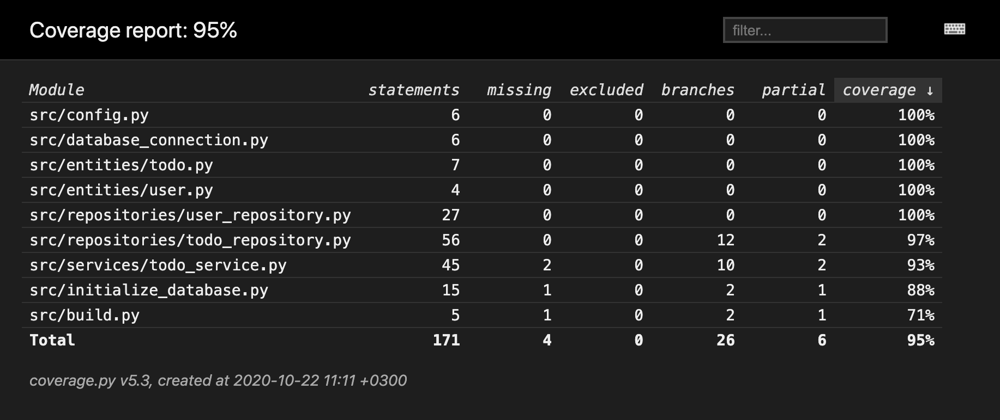

# Testausdokumentti

Ohjelmaa on testattu sekä automatisoiduin yksikkö- ja integraatiotestein unittestilla sekä manuaalisesti tapahtunein järjestelmätason testein.

## Yksikkö- ja integraatiotestaus

### Sovelluslogiikka

Sovelluslogiikasta vastaavaa `TodoService`-luokkaa testataan [TestTodoService](https://github.com/ohjelmistotekniikka-hy/python-todo-app/blob/master/src/tests/services/todo_service_test.py)-testiluokalla. `TodoService`-olio alustetaan, niin että sille injektoidaan riippuvuksiksi repositorio-oliot, jotka tallentevat tietoa muistiin pysyväistallennuksen sijaan. Tätä varten testissä on käytössä luokat `FakeTodoRepository` ja `FakeUserRepository`.

### Repositorio-luokat

Repositorio-luokkia `TodoRepository` ja `UserRepository` testataan ainoastaan testeissä käytössäolevilla tiedostoilla. Tiedostojen nimet on konfiguroitu _.env.test_-tiedostoon. `TodoRepository`-luokkaa testataan [TestTodoRepository](https://github.com/ohjelmistotekniikka-hy/python-todo-app/blob/master/src/tests/repositories/todo_repository_test.py)-testiluokalla ja `UserRepository`-luokkaa [TestUserRepository](https://github.com/ohjelmistotekniikka-hy/python-todo-app/blob/master/src/tests/repositories/user_repository_test.py)-testiluokalla.

### Testauskattavuus

Käyttöliittymäkerrosta lukuunottamatta sovelluksen testauksen haarautumakattavuus on 95%

Testaamatta jäivät _build.py_- ja _initialize\_database.py_-tiedostojen suorittaminen komentoriviltä. Nämä olisi myös voinut jättää testikattavuuden ulkopuolelle. Lisäksi testaatamatta jäivät mm. tilanteet, joissa haetaan kirjautumattoman käyttäjän tekemättömät tehtävät ja uloskirjautuminen.

## Järjestelmätestaus

Sovelluksen järjestelmätestaus on suoritettu manuaalisesti.

### Asennus ja konfigurointi

Sovellus on haettu ja sitä on testattu [käyttöohjeen](./kayttoohje.md) kuvaamalla tavalla sekä macOS- että Linux-ympäristöön. Testauksessa on käytetty myös eri konfiguraatioita _.env_-tiedoston kautta.

Sovellusta on testattu sekä tilanteissa, joissa käyttäjät ja työt tallettavat tiedostot ovat olleet olemassa ja joissa niitä ei ole ollut jolloin ohjelma on luonut ne itse.

### Toiminnallisuudet

Kaikki [määrittelydokumentin](./vaatimusmaarittely.md#perusversion-tarjoama-toiminnallisuus) ja käyttöohjeen listaamat toiminnallisuudet on käyty läpi. Kaikkien toiminnallisuuksien yhteydessä on syötekentät yritetty täyttää myös virheellisillä arvoilla kuten tyhjillä.

## Sovellukseen jääneet laatuongelmat

Sovellus ei anna tällä hetkellä järkeviä virheilmoituksia, seuraavissa tilanteissa:

- Konfiguraation määrittelemiin tiedostoihin ei ole luku/kirjoitusoikeuksia
- SQLite tietokantaa ei ole alustettu, eli `python -m poetry run invoke build`-komentoa ei ole suoritettu
